# Лабораторная работа №1
## Начало работы с MySQL и MySQL Workbench

### Цель работы

Познакомиться с MySQL Workbench, научиться создавать базу данных и таблицы, добавлять и изменять данные, а также делать связь между таблицами.

Для работы использовались MySQL Server, MySQL Workbench и Docker.

---

## Задание 1

В MySQL Workbench есть несколько основных разделов.

### Management

- **Server Status** — показывает информацию о сервере.
- **Client Connections** — показывает активные подключения.
- **Users and Privileges** — работа с пользователями и их правами.
- **Status and System Variables** — параметры работы MySQL.
- **Data Export** — экспорт данных.
- **Data Import/Restore** — импорт и восстановление данных.

### Instance

- **Startup / Shutdown** — запуск и остановка сервера.
- **Server Logs** — просмотр логов.
- **Options File** — настройки MySQL.

### Performance

- **Dashboard** — информация о нагрузке.
- **Performance Reports** — отчёты о работе сервера.
- **Performance Schema Setup** — настройка сбора информации о производительности.

Для проверки работы сервера был выполнен запрос:

```sql
SHOW DATABASES;
```

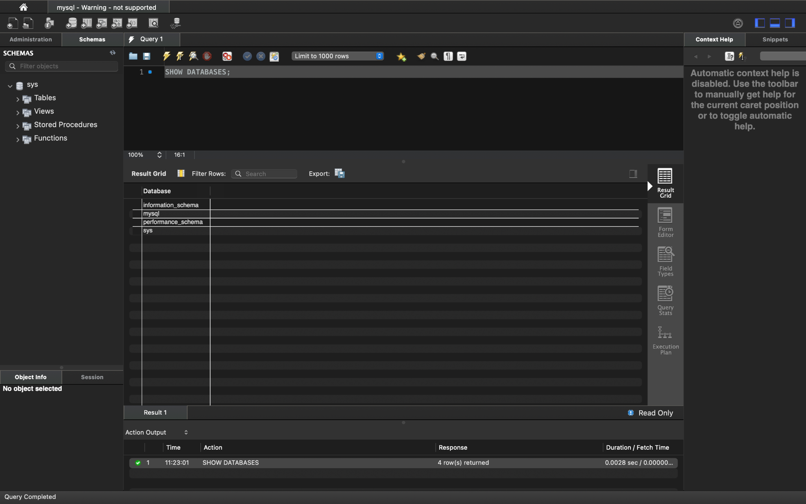

---

## Задание 2

Была создана база данных `simpledb`.

Параметры:

- Character Set — `utf8`
- Collation — `utf8_general_ci`

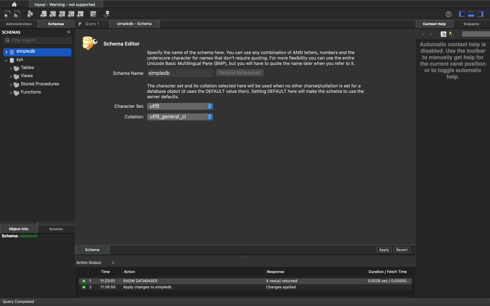

---

## Задание 3

Была создана таблица `users` с полями `id`, `name` и `email`.

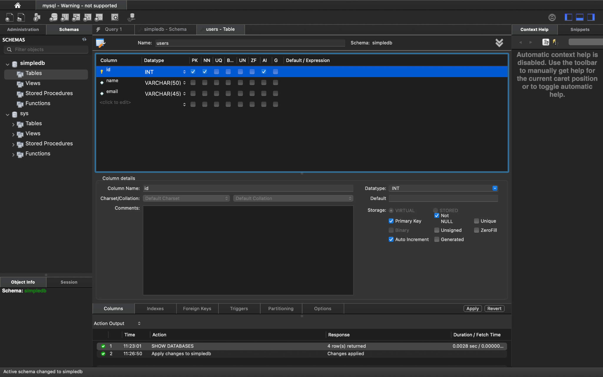

Запрос создания таблицы:

```sql
CREATE TABLE `simpledb`.`users` (
  `id` INT NOT NULL AUTO_INCREMENT,
  `name` VARCHAR(50) NULL,
  `email` VARCHAR(45) NULL,
  PRIMARY KEY (`id`)
);
```

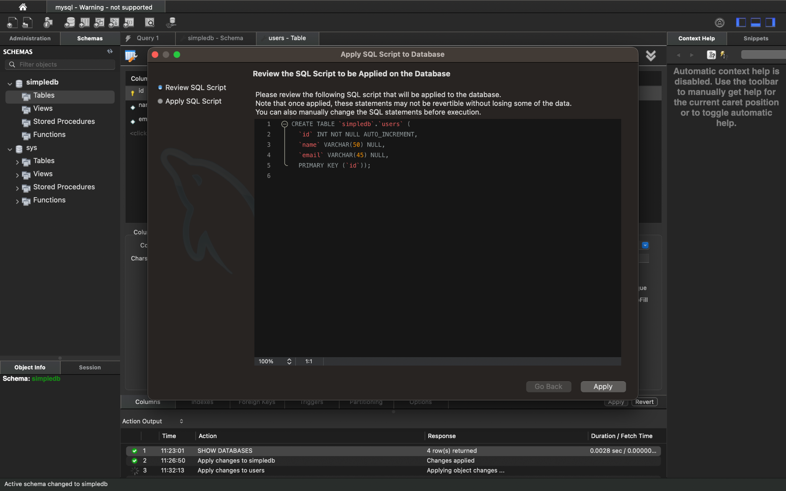

---

## Задание 4

В таблицу были добавлены три записи.

```sql
INSERT INTO `simpledb`.`users` (`name`, `email`)
VALUES ('Anna', 'anna@mail.ru');

INSERT INTO `simpledb`.`users` (`name`, `email`)
VALUES ('Ivan', 'ivan@mail.ru');

INSERT INTO `simpledb`.`users` (`name`, `email`)
VALUES ('Maria', 'maria@mail.ru');
```

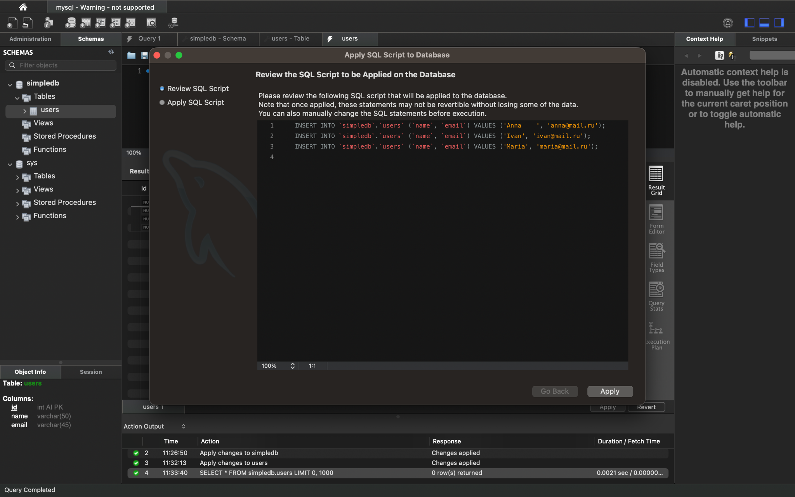

После этого был изменён email у Anna.

```sql
UPDATE `simpledb`.`users`
SET `email` = 'anna.petrov@mail.ru'
WHERE (`id` = '1');
```

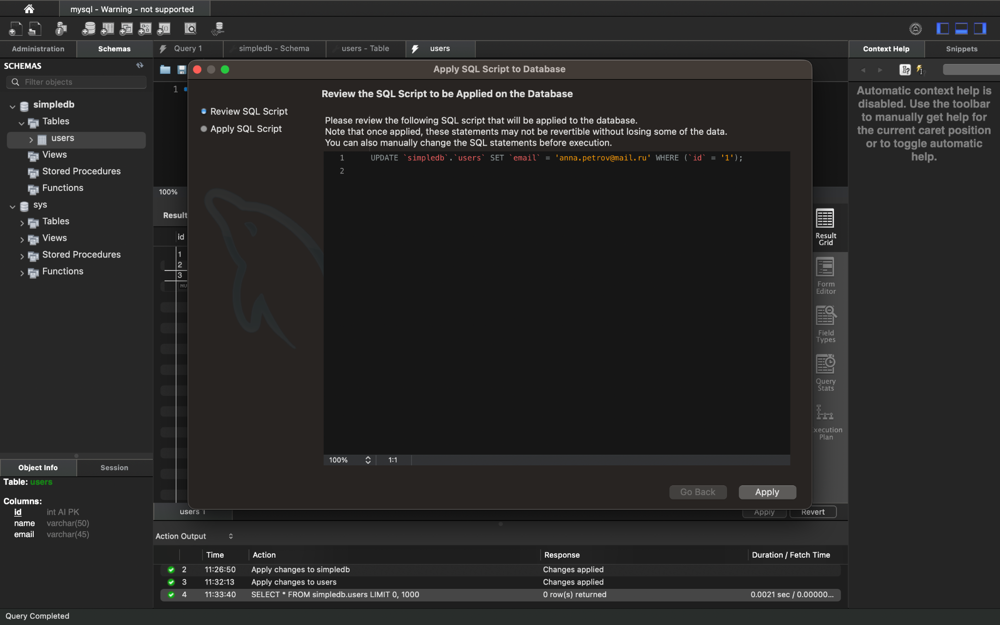

---

## Задание 5

В таблицу `users` были добавлены дополнительные поля:

- `gender`
- `bday`
- `postal_code`
- `rating`
- `created`

Поле `created` имеет тип `TIMESTAMP` и автоматически получает текущие дату и время.

Поля `gender`, `bday`, `postal_code` и `rating` можно оставить пустыми, потому что пользователь может не указывать эту информацию.

```sql
ALTER TABLE `simpledb`.`users`
ADD COLUMN `gender` ENUM('M', 'F') NULL AFTER `email`,
ADD COLUMN `bday` DATE NULL AFTER `gender`,
ADD COLUMN `postal_code` VARCHAR(10) NULL AFTER `bday`,
ADD COLUMN `rating` FLOAT NULL AFTER `postal_code`,
ADD COLUMN `created` TIMESTAMP NOT NULL DEFAULT CURRENT_TIMESTAMP() AFTER `rating`;
```

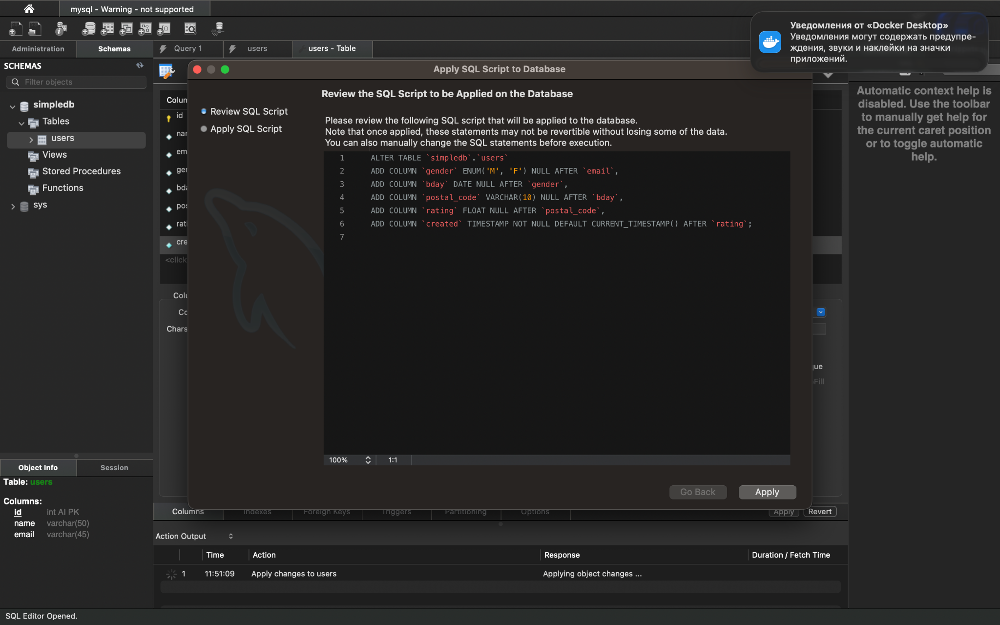

---

## Задание 6

Были добавлены новые пользователи.

```sql
INSERT INTO `simpledb`.`users`
(`name`, `email`, `postal_code`, `gender`, `bday`, `rating`)
VALUES
('Ekaterina', 'ekaterina.petrova@outlook.com', '145789', 'F', '2000-02-11', '1.123');

INSERT INTO `simpledb`.`users`
(`name`, `email`, `postal_code`, `gender`, `bday`, `rating`)
VALUES
('Paul', 'paul@superpochta.ru', '123789', 'M', '1998-08-12', '1');
```

После этого данные были проверены:

```sql
SELECT * FROM simpledb.users;
```

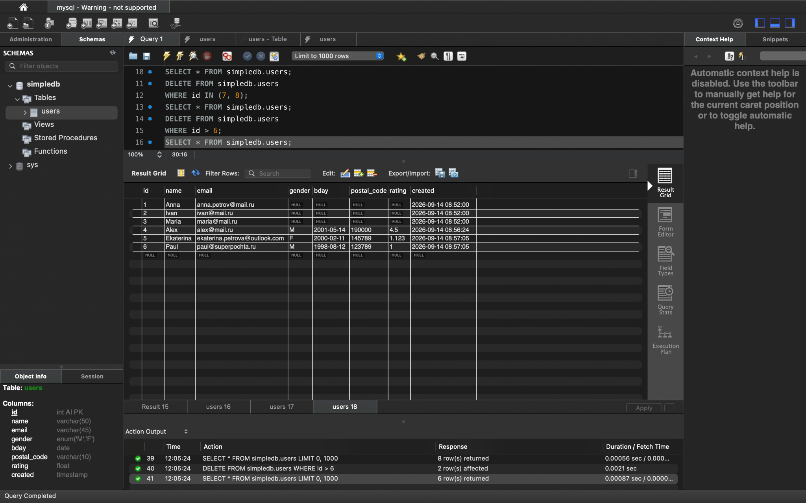

---

## Задание 7

Таблица `users` была экспортирована в SQL-файл.

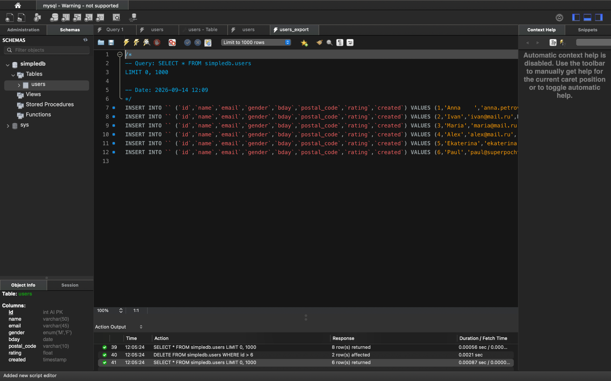

В полученном файле используются запросы `INSERT INTO`, которые добавляют записи в таблицу.

---

## Задание 8

Была создана таблица `resume`.

Поля таблицы:

- `resumeid`
- `userid`
- `title`
- `skills`
- `created`

Также был создан внешний ключ между `resume.userid` и `users.id`.

```sql
CREATE TABLE `simpledb`.`resume` (
  `resumeid` INT NOT NULL AUTO_INCREMENT,
  `userid` INT NOT NULL,
  `title` VARCHAR(100) NOT NULL,
  `skills` TEXT NULL,
  `created` TIMESTAMP NULL DEFAULT CURRENT_TIMESTAMP(),
  PRIMARY KEY (`resumeid`),
  INDEX `fk_resume_users_idx` (`userid` ASC) VISIBLE,
  CONSTRAINT `fk_resume_users`
    FOREIGN KEY (`userid`)
    REFERENCES `simpledb`.`users` (`id`)
    ON DELETE CASCADE
    ON UPDATE CASCADE
);
```

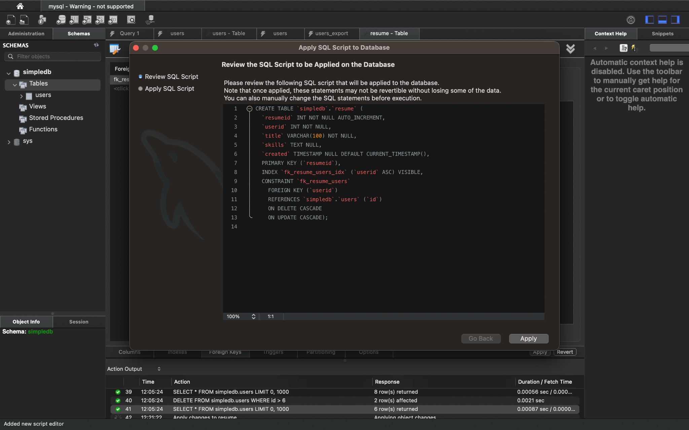

---

## Задание 9

В таблицу `resume` были добавлены несколько записей.

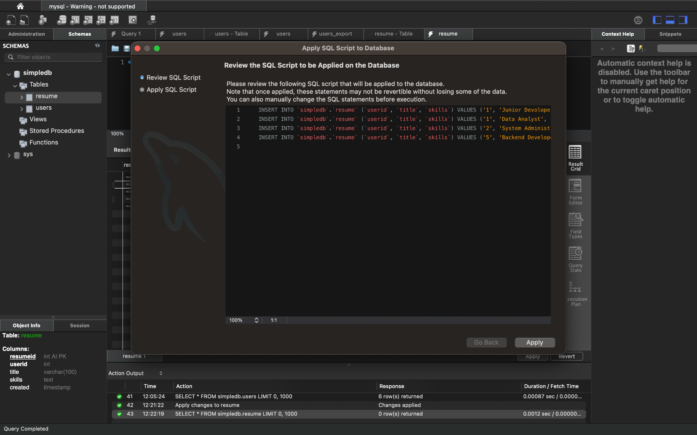

У одного пользователя может быть 0 или несколько резюме.

После этого была сделана попытка добавить резюме с `userid = 999`.

```sql
INSERT INTO simpledb.resume
(userid, title, skills)
VALUES
(999, 'Test Resume', 'SQL');
```

Запрос завершился ошибкой, потому что пользователя с таким id нет в таблице `users`.

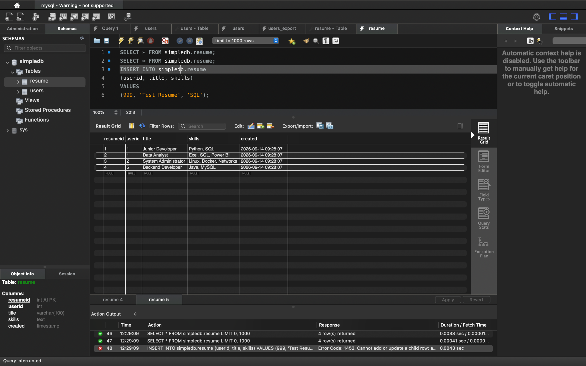

Таблица `resume` также была экспортирована в SQL-файл.

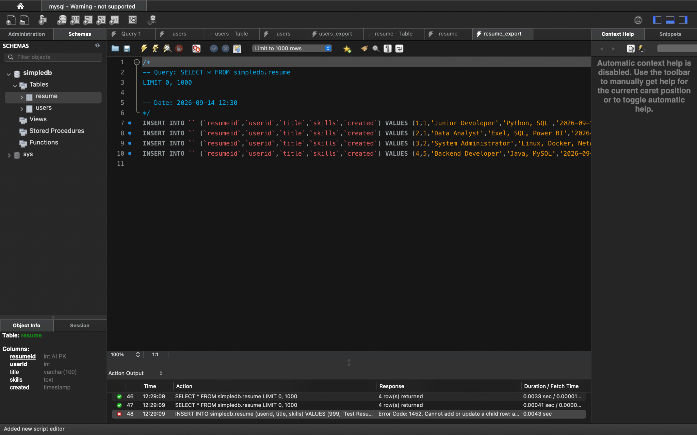

---

## Задание 10

Сначала был изменён id пользователя с `5` на `50`.

```sql
UPDATE `simpledb`.`users`
SET `id` = '50'
WHERE (`id` = '5');
```

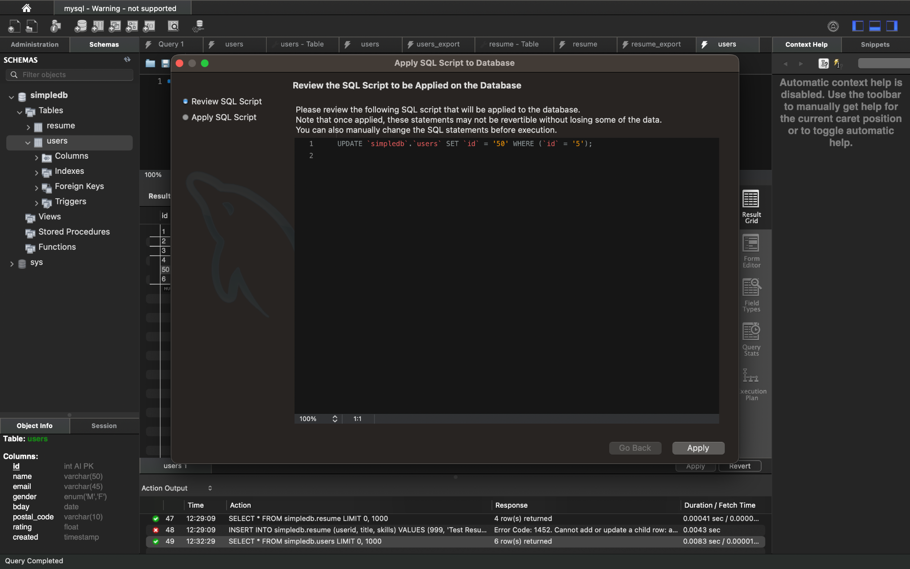

После этого `userid` в связанной записи таблицы `resume` тоже изменился на `50`.

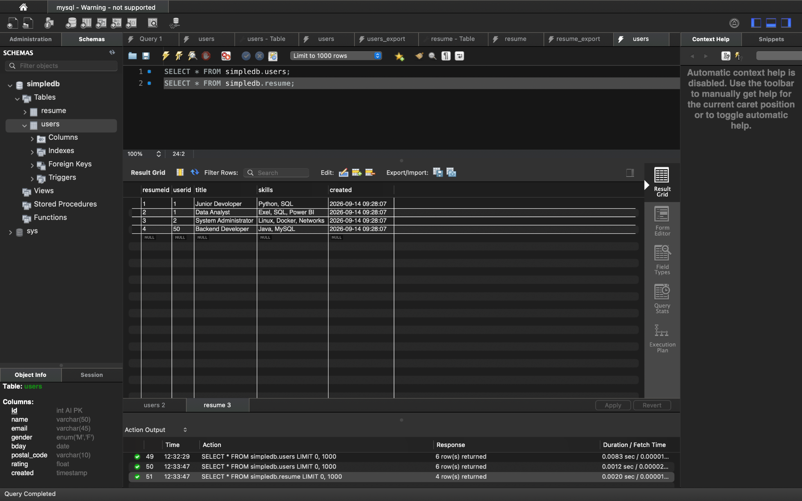

Затем был удалён пользователь с `id = 1`. После удаления связанные с ним резюме тоже удалились автоматически.

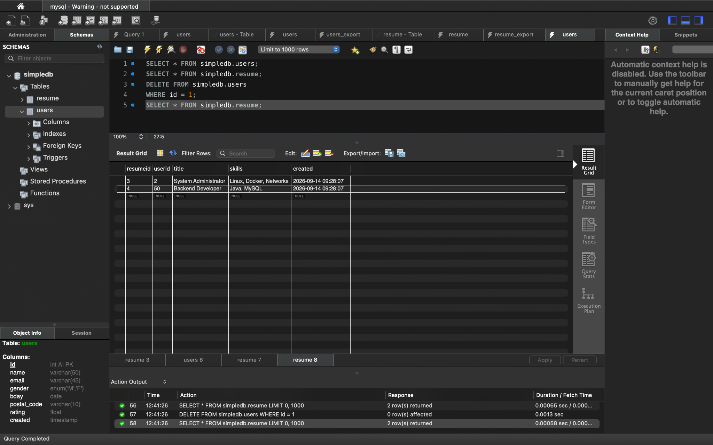

---

## Вывод

В ходе лабораторной работы я научилась создавать базы данных и таблицы в MySQL Workbench, добавлять и изменять данные, выполнять SQL-запросы и экспортировать данные. Также я создала связь между двумя таблицами и проверила работу `ON UPDATE CASCADE` и `ON DELETE CASCADE`.
