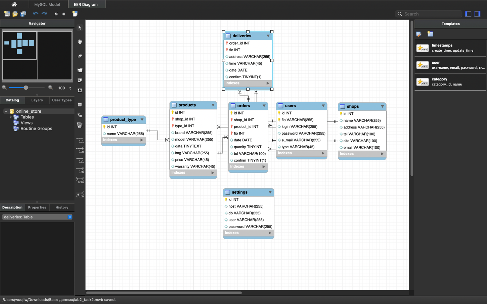
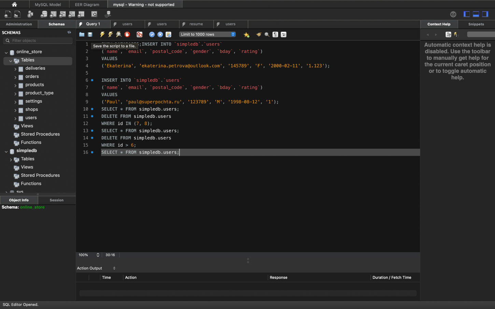
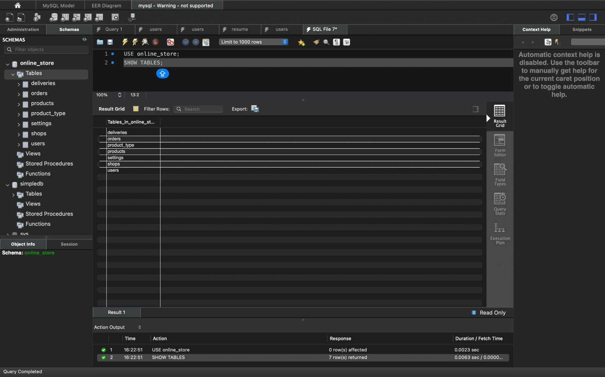
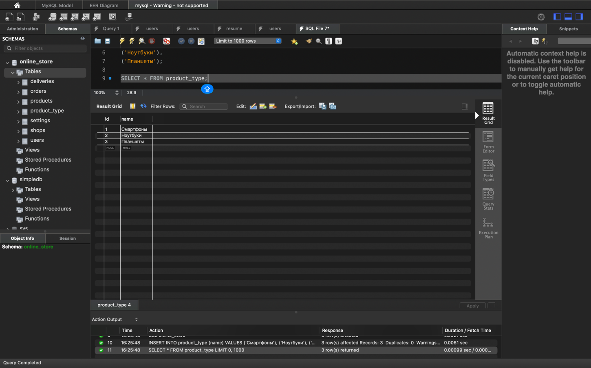
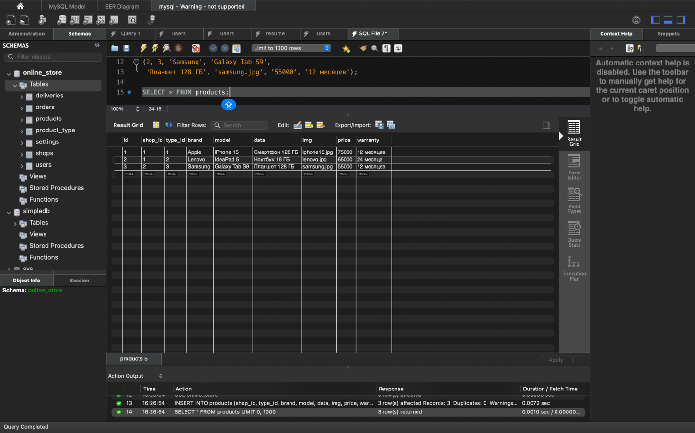
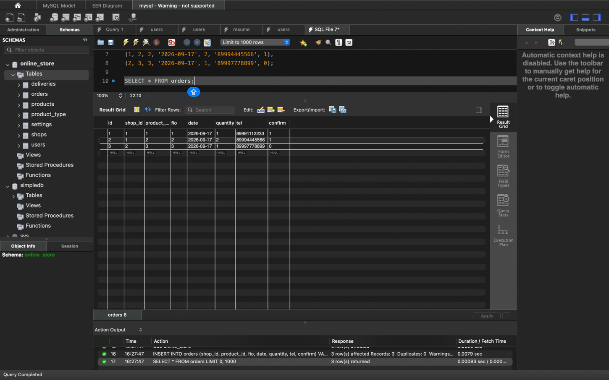
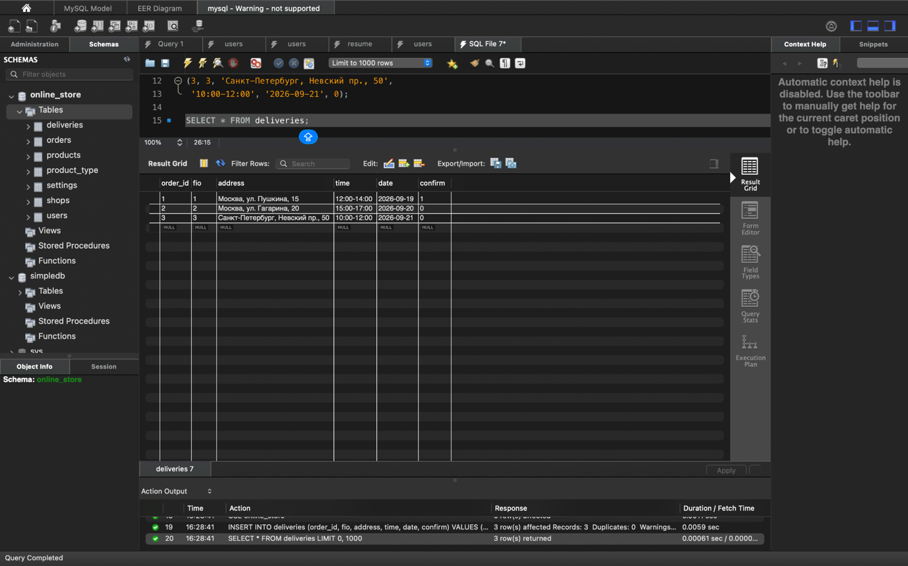
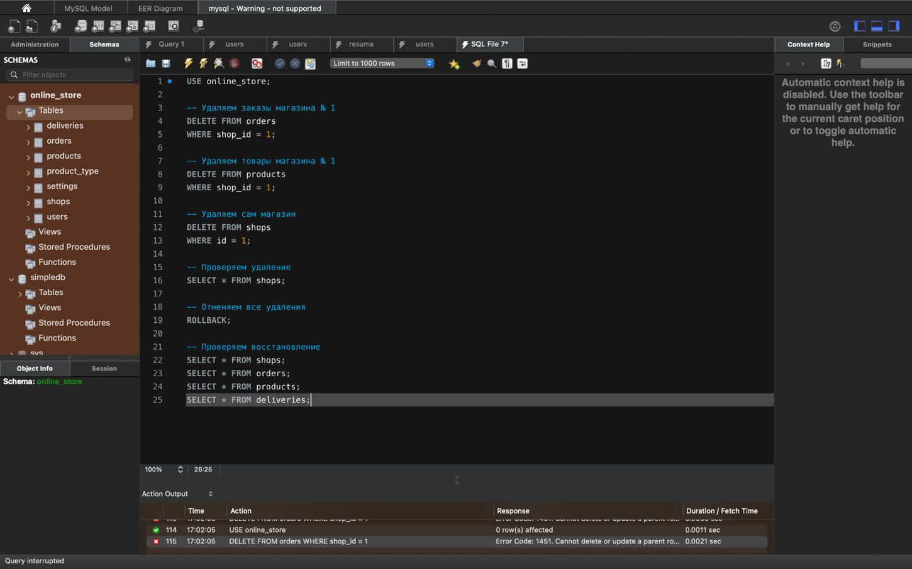
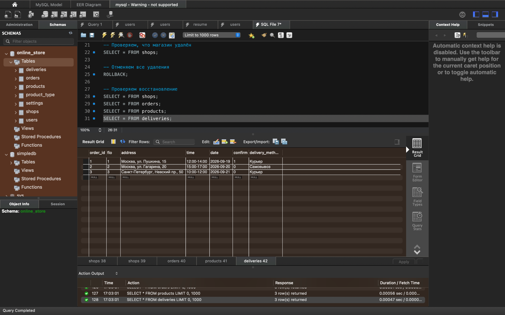
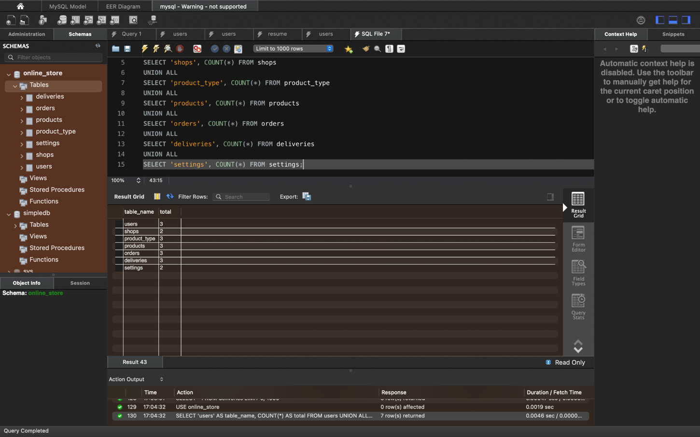

# Лабораторная работа № 2
## Создание модели базы данных интернет-магазина в MySQL Workbench

### Цель работы
Научиться создавать EER-диаграмму, задавать таблицы и внешние ключи, получать SQL-скрипт из модели, создавать базу данных на сервере и проверять работу связей между таблицами.

Для работы использовались MySQL Workbench, MySQL Server в Docker и SQL.

### 1. Создание модели
Я создала схему `online_store` и добавила семь таблиц:

| Таблица | Для чего нужна |
| --- | --- |
| `users` | Покупатели и их данные |
| `shops` | Магазины |
| `product_type` | Категории товаров |
| `products` | Товары |
| `orders` | Заказы |
| `deliveries` | Доставка заказов |
| `settings` | Учебные настройки подключения |

Для записей заданы ключи, а между связанными таблицами — внешние ключи. Например, `products.shop_id` ссылается на `shops.id`, а `orders.product_id` — на `products.id`. В таблице `deliveries` поле `order_id` связано с `orders.id`.



Исходная модель сохранена в файле [`lab2_task2.mwb`](lab2_task2.mwb).

### 2. Создание базы на сервере
Через **Forward Engineer** в MySQL Workbench я сформировала SQL-скрипт из модели и выполнила его на сервере. Скрипт находится в файле [`task2_model.sql`](task2_model.sql). Он содержит создание схемы, семи таблиц, индексов и внешних ключей.



Для проверки я выполнила:

```sql
USE online_store;
SHOW TABLES;
```

В списке появились все семь таблиц.



### 3. Заполнение таблиц
С помощью `INSERT INTO` я добавила учебные данные о покупателях, магазинах, категориях, товарах, заказах, доставках и настройках. Затем проверила их командами `SELECT`.

Пользователи:


Магазины:



Товары:



Заказы:



Доставки:



Настройки (использованы вымышленные учебные реквизиты):


### 4. Изменение структуры и данных
Командой `ALTER TABLE` я добавила по одному полю в каждую таблицу. Затем с помощью `UPDATE` заполнила их в существующих записях. В исходном файле `task2_model.sql` этих изменений **нет**, так как он был экспортирован до выполнения команд `ALTER TABLE`. Сами изменения приведены в файле [`changes.sql`](changes.sql) как отдельный пример для первоначальной модели.

| Таблица | Добавленное поле |
| --- | --- |
| `users` | `phone VARCHAR(20)` |
| `shops` | `working_hours VARCHAR(50)` |
| `products` | `stock INT DEFAULT 0` |
| `orders` | `status VARCHAR(30) DEFAULT 'Новый'` |
| `deliveries` | `delivery_method VARCHAR(50)` |
| `product_type` | `description VARCHAR(255)` |
| `settings` | `description VARCHAR(255)` |

Например, для телефона была выполнена команда:

```sql
ALTER TABLE users ADD COLUMN phone VARCHAR(20);
UPDATE users SET phone = '89991112233' WHERE id = 1;
```

### 5. Проверка внешних ключей и транзакций
Я проверила удаление магазина, к которому относятся товары и заказы. MySQL запретил операцию с ошибкой `1451`, поскольку она нарушала бы связи между таблицами. В модели внешние ключи заданы с `ON DELETE NO ACTION`.



Затем начала транзакцию и удалила записи в правильном порядке: сначала доставки, после них заказы и товары, затем магазин. Командой `ROLLBACK` отменила изменения.



### 6. Итоговая проверка
Проверила число строк с помощью `COUNT(*)`. Получилось:

| Таблица | Записей |
| --- | ---: |
| `users` | 3 |
| `shops` | 2 |
| `product_type` | 3 |
| `products` | 3 |
| `orders` | 3 |
| `deliveries` | 3 |
| `settings` | 2 |



### Вывод
В ходе работы я построила модель базы данных интернет-магазина из семи таблиц, создала связи между ними и перенесла модель на сервер MySQL. Также научилась добавлять записи, изменять структуру таблиц, проверять внешние ключи и отменять удаление данных через транзакцию. После `ROLLBACK` все учебные записи остались на месте.

> Примечание: `task2_model.sql` — исходный экспорт структуры. Для воспроизведения последующих изменений служит `changes.sql`; тестовые данные и результаты их проверки показаны на скриншотах. Примерные пароли в учебных данных не предназначены для настоящего сервера.
